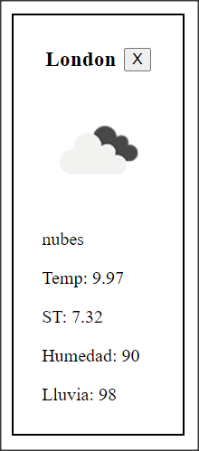
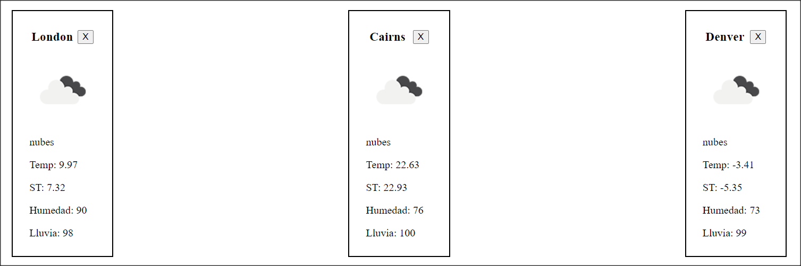
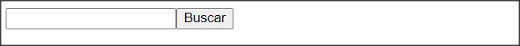

## AclimatADA App

### Ejercicio

Vamos a crear una serie de Componentes de React que luego vamos a usar en proximas practicas.

> **Nota**: Todos los Componentes que hagamos en esta practica son `Puros` y `Funcionales`, por lo tanto, ninguno tiene estado, simplemente reciben datos por props y son funciones.
>
> No te preocupes por el estilo de los componentes. En siguientes practicas implementaremos estilos, utilizaremos algunos estilos en linea por el momento (Las imagenes son puramente ilustrativas).

En la carpeta `src` vas a encontrar ya el esqueleto del proyecto React, y los archivos donde deberás codear cada Componente.

Sabemos que los Componentes de React tiene que cumplir el principio de una sóla responsabilidad, es decir que cada Componente debé cumplir una sóla tarea bien definida. Los Componentes que vamos a codear son:

#### **Card (`components/Card.js`)**

Esta tarjeta va a mostrar los datos de una ciudad con una imagen que representa el estado del clima (soleado, nublado, etc..), además cuando el usuario haga click en la X de cerrar, se invocará una función que tambien viene como prop.

Este Componente va a recibir las siguientes props:

- **name**: Nombre de la ciudad.
- **temp**: Temperatura actual.
- **description**: Descripcion del clima.
- **feels_like**: Sensacion termina.
- **humidity**: Humedad.
- **clouds**: Cantidad de nubes o probabilidad de precipitaciones.
- **img**: nombre de la imagen que se debe mostrar.
- **onClose**: recibe una función que se va a ejecutar cuando el usuario haga click en el botón de cerrar (Podemos hacer que ejecute un alert sencillo, deberia llegar desde el componente App.jsx).

Todos estos datos van a venir de una API de clima en el futuro, pero por ahora no nos interesa esa parte. Te voy a dar datos de prueba para que puedas ver tu componente funcionando.

**IMPORTANTE:** Para poder obtener la imagen correspondiente desde la API del clima deben utilizar la siguiente URL `http://openweathermap.org/img/wn/${img}@2x.png` donde img debería ser el código del icono asociado a la imagen que recibe como prop. Por ejemplo: http://openweathermap.org/img/wn/02d@2x.png

#### **ContainCard (`components/ContainCard.js`)**

Este Componente va a servir para renderizar muchos Componentes `Cards`. Básicamente, este componente va a recibir un arreglo de `ciudades` (con todos sus datos), y va a crear un componente `Card` por cada ciudad, pasandole las props correspondientes.

#### **SearchBar (`components/SearchBar.js`)**

Este componente, debe llevar un input del tipo texto y un boton que servira para buscar la ciudad.
En el futuro, este componente ira a buscar una nueva ciudad a la api para sumarlo al array de ciudades que ya tenemos.

> SearchBar debe renderizarse en la parte superior de la aplicacion, es decir, por encima de ContainCard en App.

  

### Instrucciones para correr el proyecto

#### `npm install`

Instala todas las dependecias necesarias para correr el proyecto correctamente a la altura del package.json

#### `npm run dev`

Comienza a correr la aplicación de forma local por lo que se puede ver desde el navegador accediendo a
http://127.0.0.1:5173/

> No es necesario volver a correr el proyecto cada vez que se realice un cambio sino que se verá automáticamente reflejando en el navegador. Si se detecta que no se aplica un cambio automaticamente, es recomendable en ese caso actualizar el navegador
